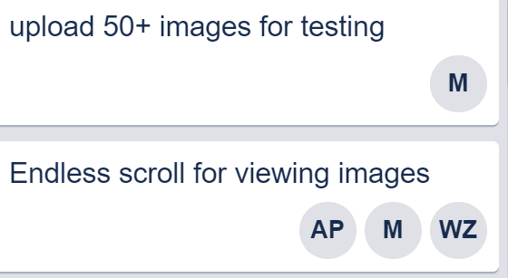

## 1. Team Member Function

* Jingwen Yu (Project Manager)
* Akshay Patel(Developer)
* Maryam Ibad (Jr. Developer)
* Wenzhao Zhang(UI/UX Developer)
* Hugo Zamarripa Vazquez (IT operations)
* Junhua Dong (Tom)(Backup)

## 2. Goals for this sprint

* To have separate boxes for application and database servers and able to communicate in between
* Minor fix for multi-tag function and able to upload pictures with multiple tags by a comma
* To create admin privilege, such as contact users, view all users info, and delete functions
* Continue modify CSS to make sure fits different screen sizes

## 3. Accomplishments

* We have implemented functions for admin. Admin can contact users and users will receive an email with the message the admin left with.
* We are able to have separate boxes for database and application servers. The boxes can able to communicate in between.
* Users can able to search and add tags by a comma
* Implement function to avoid endless scroll to view images

## 4. Bug Tracking

* Resolve the issue with multi-tag function that users can able to add tags for upload and search for multi-tags

## 5. Security Assumptions

* We have created a .gitignore file and have add all these security-related files in it, to avoid it being pushed to our repository. The SSL keys are now self-generated by our post-installation script for packer.

## 6. Team members comment

* Jingwen: As a project manager, I assigned task to the team members and ensured that the tasks are done. For this last sprint, I have checked that if every function is working properly and able to maintain it. I would check in with members to see if everything is working good and helped out if they needed me.
* Akshay: As the developer the CSS needed the most work, so that's what the focus was on for this sprint. We were figuring out if we can resize the images being uploaded via CSS so it fit to screen and don't overlap. Played around with the CSS and tried new things. Also working with the Jr. developer for ‘endless scroll’ option.
* Maryam: As a Jr. developer for this sprint, I was more focused on testing the environment and see what could happen in different scenarios. I uploaded more than 50 images to our site, to see if we run into issues with the site and the db. I also tried out how the images would be displayed and due to time constraints I decided to stick with the ‘endless scroll’ option for when viewing images.
* Wenzhao: As a UI/UX developer for this sprint, I fixed and finalized our overall layout design as well as fixing some small issues such as indentation and padding to improve the presentation. I also spent time on building a separate vagrant box for the mongodb database server. It works as expected but I ran out of time to configure a build script for it
* Hugo: As IT Operations part of my main task was troubleshooting why building the machine didnt work on a machine and what could be improved on within the script so that everyone could successfully build. Esppeciallly with the added mbuild step for the database we had constnt stand stills on machines for almost no apparent reason.
* Junhua(Tom):

## 7. Referenced material

## Project Base Requirement

1. Language and framework of your choice (ITM 311, ITM 312, ITMD 361, ITMD 411)

    * We are using the node.js as environment language and express as the framework.

2. Operating System Platform of Choice (ITM 301, ITMO 456)

    * Ubuntu Vanilla 16.04 was used because of its has a relatively small installation size and all the dependencies / packages we needed for our projects are available on it.
    * We are using a list of npm packages for our projects, includes: express, gridfs-stream, multer, passport-local

3. Use of Data Store/Storage (ITMD 421, ITMD 411, ITMO 456)

    * We are using MongoDB for data storage, and Gridfs in cooperated to store images to our MongoDB, it divides our image files into small chunks of data and stored within the MongoDB collections.

4. Data encrypted at rest (ITMS 448)

    * All our user password are hashed and stored in our MongoDB user schema
    (https://github.com/illinoistech-itm/2019-team-08f/blob/master/diagrams/sprint-report-screenshots/hash.JPG)

5.  Database makes use of master/slave replication (~ITMD 421, ITMD 411)

    * Schema creation: User Schema for user, and mongodb automatic generated metadata table for image(upload.files shcema and upload.chunks schema), all the comments are stored in the comment schema.
    (https://github.com/illinoistech-itm/2019-team-08f/blob/master/diagrams/sprint-report-screenshots/schemas.JPG)
    * Master for database writes: MongoDB primary dataset will be used to write data. The primary dataset will perform all write operations and store user data.
    * Slave for database reads: Data will be read from MongoDB replica set. The replica set will replicate what’s in the primary dataset and serves as a backup. The master slave replication has been deprecated, so we use replica set to read from primary database.

6. Use of Responsive design (where applicable) (ITMD 361, ITMD 362)

    * We use Bootstrap and also write our own CSS to overwrite some of those (With the !important rule). Bootstrap is used to create an overall design for our website, while CSS is used to adjust small details and customization.
    (https://github.com/illinoistech-itm/2019-team-08f/blob/master/diagrams/sprint-report-screenshots/responsive.PNG)

7.  Use of https (ITMS 448, ITMO 456)

    * Self-signed certifications are created in part of our post-installation script and we configured a .gitignore file to ignore it.
    * We used passport-authenticate to authenticate users. The username and password must be matched the credentials in our database in order to login
    * All ports are blocked, only port 443 and 80(port 27017 is opened too for our live demo, but since we didn't have two boxes ready for automation, only port 443 and 80 is opened for our current box) are explicitly allowed in Vanilla 16.04 since it is served as a web server.
    * https://flaviocopes.com/node-mongodb/
    * Pre-seed user record
    

8. Use of user authentication (ITMD 361)

    * If user is not authenticated/login, the user is not able to upload and delete pictures, and post comments. User is able to see his/her own profile.
    * If user is authenticated/login, the user is able to upload and delete pictures, and post comments.
    * Admin is able to view all users' information and delete all pictures. Admin can contact users.
    * Authenticated users and admin is able to edit tags

9.  Creation of Dev Environment (local laptop) (ITMO 456)

    * Two ubuntu vanilla 16.04 boxes was created, one for web server and the other one is for mongodb storage, and they are communicating with each other based on their ip address. Unfortunately we didn’t have enough time to configure a automated build script(mostly because of the manual configuration that is needed to be done after the application runs), but the video we recorded showed that it is working properly.

10. Layout design (ITMD 361, 362, ITMM 471)

    * Diagrams are located under Diagram -> UI -> UI_Diagram folder (https://github.com/illinoistech-itm/2019-team-08f/blob/master/diagrams/UI/UI_Diagram/desktop_add.png)
    * We used this chart to adjust our font sizes in different view
    http://cristian.sulea.net/blog/css-font-size-px-vs-em-vs-percent-vs-pt/
    * We used this to pick our color and generate RGB values
    https://www.w3schools.com/colors/colors_picker.asp

11. Management of Visio (or comparable) diagram tool of work flow (ITM 301, ITMO 456)

    * The user and admin flowcharts: https://github.com/illinoistech-itm/2019-team-08f/blob/master/diagrams/UI/sitemap.pdf

12. Management of project progress (ITMM 471)

    * 
    * 
    * 

13. Team must generate at least 15 real “test” user data that is inserted upon instance creation and proper data to test functionality of a system

    * The 15 test user will be generated via collection.insertOne()
